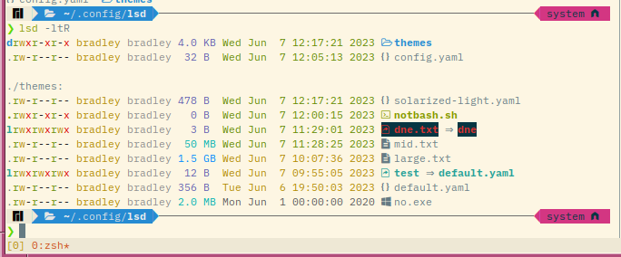

# Solarized Light Color Theme for LSD

This is a theme for [LSD (LSDeluxe)](https://github.com/lsd-rs/lsd), which is a
rewrite of the GNU utility `ls` with lots of added features like colors, icons,
tree-view, more formatting options etc.

The default color theme works well for terminals using a dark color theme. However,
some of the colors in the default theme make reading some information,
particularly file information using `lsd -l`, impossible using a terminal with a
light theme.

This theme is designed using the [Solarized](https://github.com/altercation/solarized) light color scheme, but should work well with most light-colored terminal themes. I've tried to keep the spirit of the default theme by using different colors for file size, date, and file permissions.



## Installation

Copy the `theme` directory from this repository and its contents to your XDG Base
Directory, e.g. `~/.config/lsd` (you may need to create this directory). In your
configuration file, e.g. `~/.config/lsd/config.yaml`, add the following entry:

```yaml
color:
  theme: solarized-light
```

## Feedback and Future Release

Please offer any suggests via pull request or issues. If there is interest, I may add a
solarized-dark theme.
