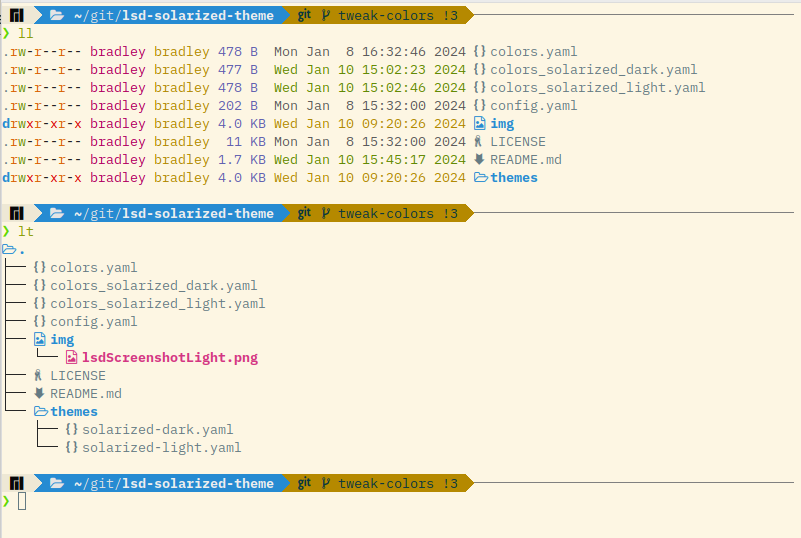
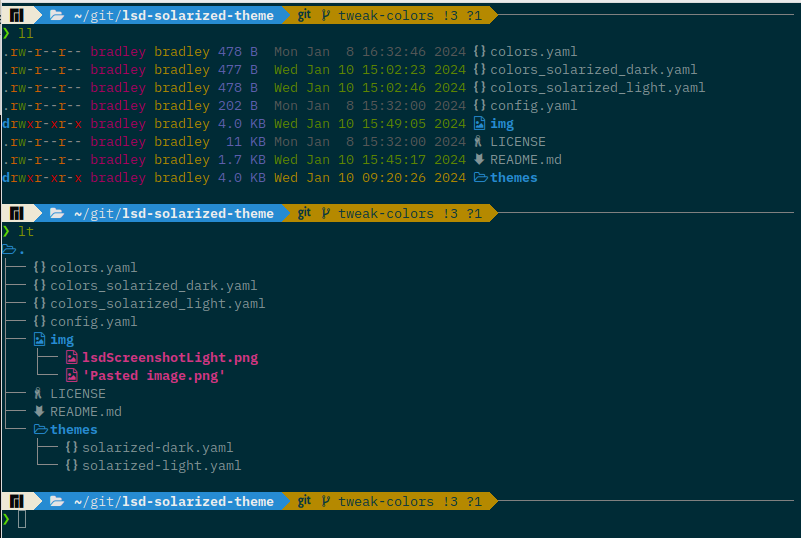

# Solarized Color Theme for LSDeluxe (lsd)

_Now with light and dark themes!_

These are light and dark Solarized themes for [LSD (LSDeluxe)](https://github.com/lsd-rs/lsd), which is a
rewrite of the GNU utility `ls` with lots of added features like colors, icons,
tree-view, more formatting options etc.

This theme is designed using the [Solarized](https://github.com/altercation/solarized) color scheme, but should work well with most light-colored terminal themes. I've tried to keep the spirit of the default theme by using different colors for file size, date, and file permissions.

*Light Theme*



*Dark Theme*



## Installation

Configuring a custom theme for LSD depends on what version is on your system. Check your version with `lsd --version`. For either version, create a `lsd` directory to your XDG Base Directory, e.g. `~/.config/lsd`.

### LSD Version 1.0.0 or later

Copy the contents of either `color_solarized_light.yaml` or `color_solarized_dark.yaml` in the parent directory of this repository to `~/.config/lsd/colors.yaml`. To use the theme, add the following to your `~/.config/lsd/config.yaml` file (you may need to initialize this directory and config files first if they don't exist):

```yaml
color:
  theme: custom
```

### Older versions

Recursively copy the `themes` directory in this repository to your `~/.config/lsd` directory. In your configuration file, e.g. `~/.config/lsd/config.yaml`, add the following entry for the light theme:

```yaml
color:
  theme: solarized-light
```

Or for the dark theme:

```yaml
color:
  theme: solarized-dark
```

## Feedback and Future Release

Please offer any suggests via pull request or issues. If there is interest, I may add a
solarized-dark theme.
